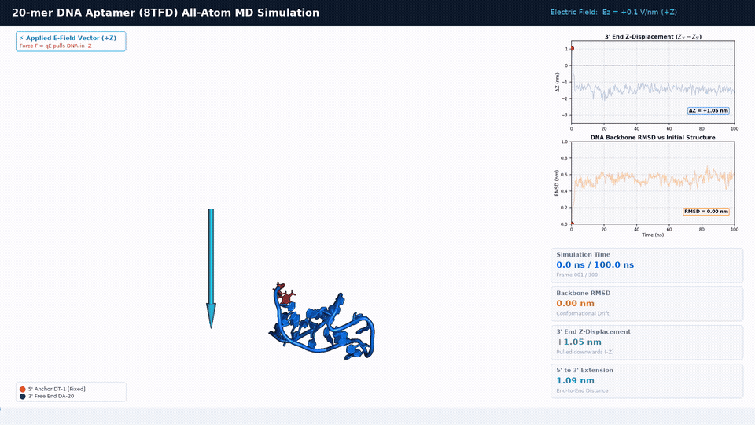
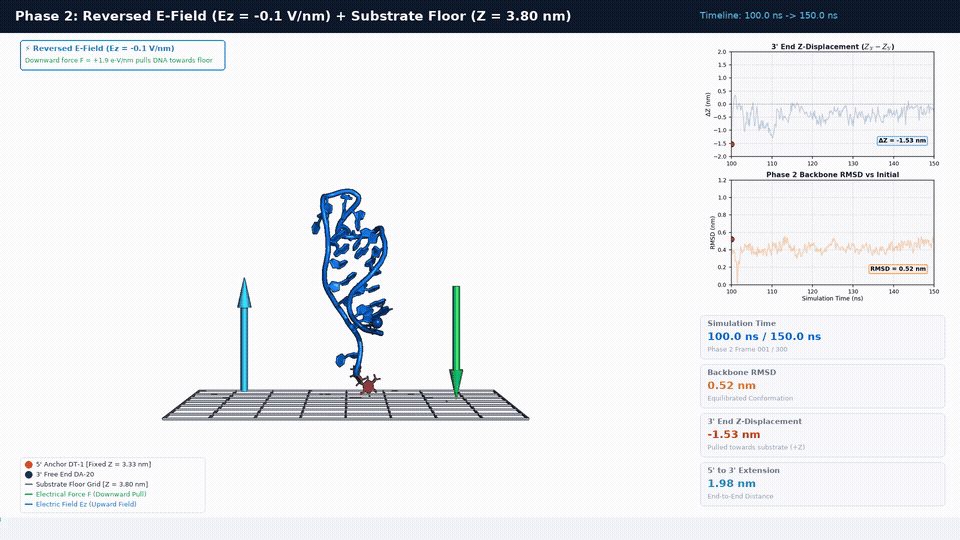

# DNA Aptamer MD Simulation Pipeline with 5' Anchor & Electric Field

A molecular dynamics (MD) pipeline for simulating a single DNA aptamer (20-mer) tethered at its 5' end under an external DC electric field in physiological salt, 0.15 M NaCl.

## Simulation setup

* System: 20-mer DNA aptamer, `DT1` to `DA20`, extracted from PDB `8TFD`.
* Force field: AMBER DNA.OL15 with TIP3P water.
* Solvent: Truncated octahedron box with 0.15 M NaCl, containing 36 Na⁺ ions, 17 Cl⁻ ions, and 5,099 water molecules.
* Engine: GROMACS 2026.2 with GPU acceleration.
* Electric field: Phase 1 applies a static DC field of 0.1 V/nm (100 MV/m) along the +Z axis. Phase 2 reverses the field to -0.1 V/nm.
* Restraint: Heavy atoms of the 5' terminal nucleotide, `DT 1`, are anchored with a force constant of 1,000 kJ mol⁻¹ nm⁻².

## Phase 1: 100 ns under a +Z electric field

The first phase applies an electric field of +0.1 V/nm along Z while the 5' end remains restrained. The animation shows the aptamer trajectory with synchronized plots of 3' end Z-displacement and backbone RMSD.

[Open the Phase 1 GIF](analysis/videos/aptamer_100ns_trajectory.gif)

## Phase 2: reversed field and substrate wall

The second phase continues for 50 ns, covering 100-150 ns on the combined timeline. It reverses the electric field to -0.1 V/nm and adds an aptamer-only floor wall at Z = 3.80 nm.

[Open the Phase 2 GIF](analysis/videos/aptamer_phase2_trajectory.gif)

